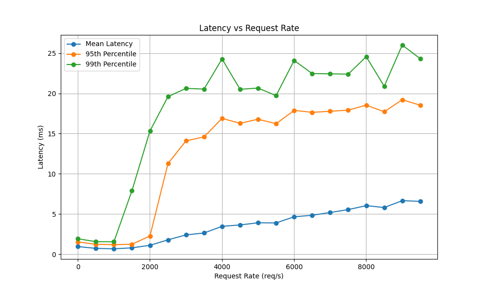
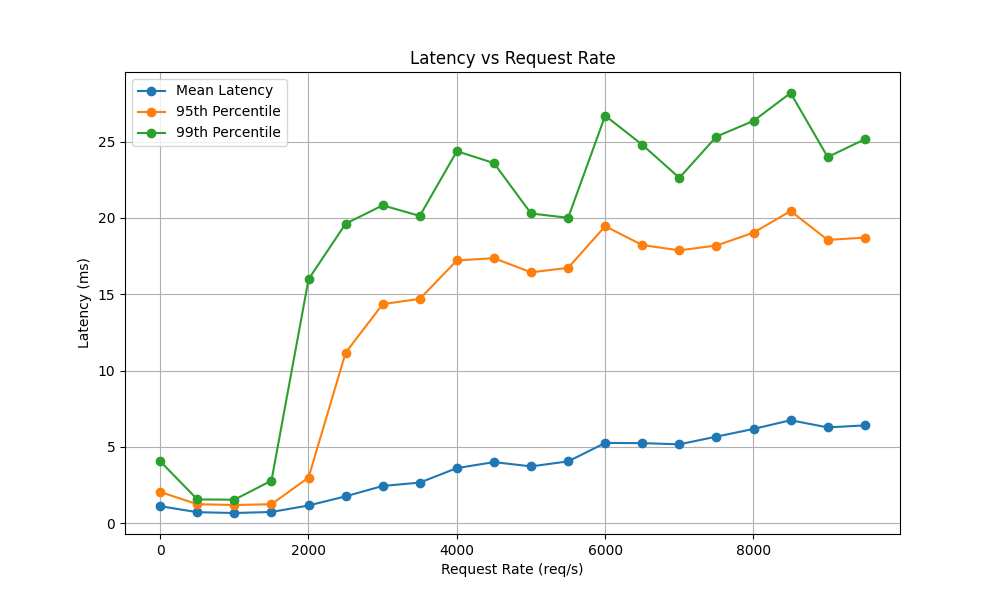
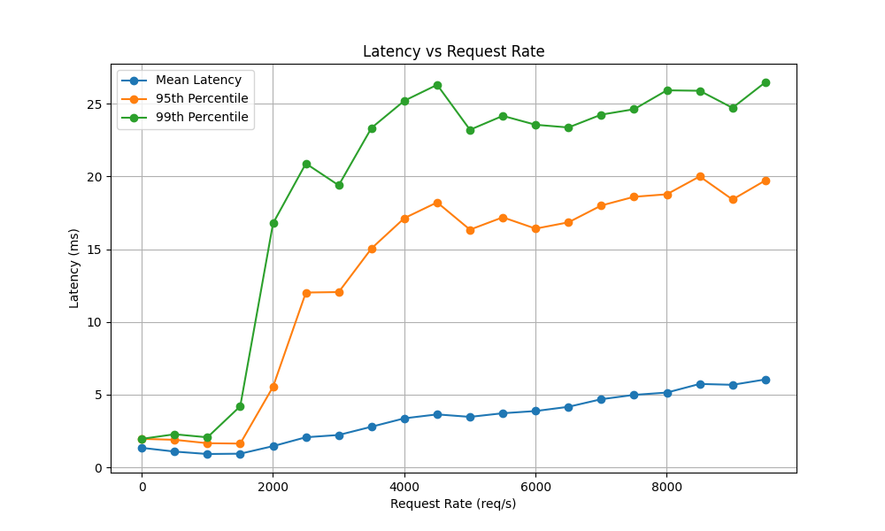
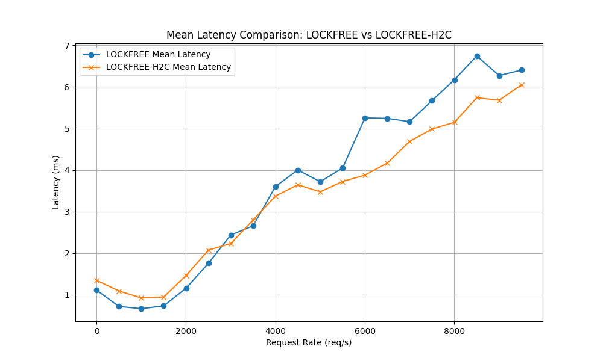

# Low-Latency Key-Value Cache HTTP Server

This project implements a high-performance HTTP server with an in-memory key-value cache, built using Rust and the Axum framework. The server is designed for low-latency operations, leveraging lock-free data structures, multithreading, and HTTP/2 optimizations.

## Background

- **Lock-Free Data Structures**: Utilizes the `papaya` crate's lock-free `HashMap` to enable concurrent access without traditional locking mechanisms.
- **Multithreading**: Employs a custom Tokio runtime with multiple worker threads to handle high load efficiently.
- **HTTP/2 Streaming Optimizations**: Leverages Axum's support for HTTP/2 to improve throughput and reduce latency under concurrent requests.

The server supports basic CRUD operations:
- `GET /` - Returns a "Hello, World!" message.
- `POST /store/{key}` - Stores a value for the given key.
- `GET /get/{key}` - Retrieves the value associated with a key.

## Server Usage
flags
```
# Run with default settings (port 3000, 250 concurrent connections)
cargo run --release

# Run with custom settings
cargo run --release -- --port 8080 --concurrency-limit 100
```

usage
```
# Store a value
curl -X POST http://localhost:3000/store/mykey -d "my value"

# Retrieve a value
curl http://localhost:3000/get/mykey

# Health check
curl http://localhost:3000/
```

## Benchmarks

The server has been benchmarked with a workload of 80% reads and 20% writes, simulating a typical caching scenario. Below are placeholders for benchmark results comparing different configurations:

### Fine-Grained Locking vs. Lock-Free

The best benchmarked hashmap for finegrained locking is dashmap. A newer map called papaya is a truer lock-free implementation. Here they are both benchmarked on the 80/20 workload.

### Fine Grained

### Lock Free


### HTTP/1.1 vs. HTTP/2
Lock Free map using H2C


Direct Comparison. Around 3000 TPS, H2C becomes more efficient due to I/O overhead


Take a look at the results folder for flamegraphs and numerical data. 

## Optimizations

The server incorporates several optimizations to achieve its low-latency goals:

- **Lock-Free HashMap**:
  - Uses `papaya::HashMap` for thread-safe, lock-free key-value storage.
  - Pre-allocates capacity for 1,000,000 entries to reduce resizing overhead.

- **Custom Tokio Runtime**:
  - Configured with 8 worker threads to maximize CPU utilization.
  - Sets a 4MB stack size per thread to handle deep call stacks.
  - Uses a global queue interval of 10 for efficient task distribution.
  - Implements a 100ms thread keep-alive to reduce thread churn.

- **Optimized TCP Listener**:
  - Enables `SO_REUSEADDR` (and `SO_REUSEPORT` on Unix) for faster restarts.
  - Sets `TCP_NODELAY` to disable Nagle's algorithm, reducing latency.
  - Configures 4MB send/receive buffers for high-throughput scenarios.
  - Supports a backlog of 4096 connections to handle bursts of traffic.

- **Concurrency Control**:
  - Applies a `ConcurrencyLimitLayer` with a configurable limit (default 250, capped at 500) to prevent overload.
  - Uses `Arc` for shared state to ensure safe, efficient access across threads.

- **Socket Configuration**:
  - Dynamically selects IPv4 or IPv6 based on the address.
  - Operates in non-blocking mode for asynchronous I/O.

- **Command-Line Arguments**:
  - Allows customization of port and concurrency limit via CLI flags, with sensible defaults (port 3000, concurrency 250).

- **Graceful Shutdown**:
  - Implements a `shutdown_signal` handler for clean termination on CTRL+C.

These optimizations collectively ensure the server can handle high concurrency with minimal latency, making it ideal for caching use cases.

## Future Work

Several areas are planned for further improvement:

- **Zero-Copy Handling**: Investigate zero-copy techniques for request/response processing to reduce memory overhead and improve throughput.
- **Runtime Experimentation**: Explore additional Tokio runtime configurations (e.g., thread pool size, queue strategies) to fine-tune performance.
- **Hash Function Experimentation**: Test alternative hash functions in `papaya::HashMap` to optimize for different workload patterns (e.g., collision resistance, speed).
- **NUMA Awareness**: 
  - Implement NUMA (Non-Uniform Memory Access) awareness to optimize memory access patterns on multi-socket systems.
  - Pin worker threads to specific CPU cores to reduce cross-socket memory traffic. Not implemented here due to time constraints. Otherwise, first choice of solution. Requires custom Hyper build. 
